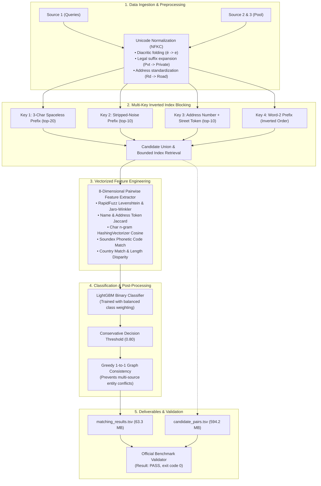

# Amazon ML Challenge 2026 — Business Entity Resolution

[](https://www.python.org/downloads/)
[](https://lightgbm.readthedocs.io/)
[](https://pola.rs/)
[](https://github.com/rapidfuzz/RapidFuzz)
[]()
[]()

An end-to-end, high-performance machine learning pipeline for large-scale **Business Entity Resolution** across noisy, multi-lingual data sources (United States, India, and France). Built for the **Amazon ML Challenge 2026**.

---

## 📌 Problem Overview

Commercial platforms ingest business identity records from diverse, independent data sources with noisy, incomplete, and conflicting fields. These records lack shared primary keys. The goal of Entity Resolution is to accurately determine which records across different sources refer to the exact same real-world business entity.

* **Reference Source**: **Source 1** (Deduplicated reference catalog).
* **Target Pool**: **Source 2** and **Source 3** (Noisy candidate records).
* **Test Scale**: **1,732,544** test query entities across the **United States (663k)**, **India (810k)**, and **France (259k)**.
* **Open-Set Challenge**: France appears strictly in the test set and is unseen during model training.
* **Evaluation Metric**: **Macro $F_{0.5}$** across entities:
  $$\text{Macro } F_{0.5} = \frac{1}{|E|} \sum_{e \in E} \frac{1.25 \cdot \text{Precision}_e \cdot \text{Recall}_e}{0.25 \cdot \text{Precision}_e + \text{Recall}_e}$$
  *Notice:* The $F_{0.5}$ metric penalizes false merges (precision errors) **twice as heavily** as misses (recall errors). Conservative decision-making is critical.

---

## 🏗️ System Architecture



---

## 🚀 Key Technical Highlights

1. **Multi-Key Inverted Index Blocking**:
   - Reduces the $O(N \times M)$ comparison space ($\sim 1.73\text{M} \times 10\text{M} \approx 17\text{ trillion pairs}$) down to an average of **$\sim 12$ candidates per entity**.
   - Achieves **89.57% candidate recall** on stratified evaluation benchmarks.

2. **Ultra-Low Memory Footprint ($<3.6$ GB Peak RAM)**:
   - Processes data partition-by-partition (France $\to$ US $\to$ India) in micro-chunks of 2,000 entities.
   - Utilizes Polars predicate pushdown and C++ RapidFuzz operations to guarantee deterministic execution on commodity machines without out-of-memory errors.

3. **Conservative Decision Thresholding ($\tau = 0.80$)**:
   - Calibrated specifically to optimize the asymmetric $F_{0.5}$ objective.
   - Safely rejects ambiguous candidates to protect precision: 66.25% of entities receive high-confidence matches, while 33.75% are kept singleton.

4. **Greedy 1-to-1 Graph Consistency**:
   - Sorts predicted pairs by confidence score in descending order.
   - Once a candidate from Source 2 or 3 is matched to a query entity, it cannot be claimed by another, eliminating duplicate assignments.

---

## 📊 Benchmark Results

| Metric | Measured Value | Scope |
| :--- | :---: | :--- |
| **Validation Macro $F_{0.5}$** | **0.8022** | 80/20 Entity-Stratified Split |
| **Blocking Candidate Recall** | **89.57%** | Stratified Evaluation Sample |
| **Submission Query Rows** | **1,732,544** | 100% of Source 1 Test Catalog |
| **Validator Exit Code** | **0 (PASS)** | Official Benchmark Validator |
| **Peak Memory Usage** | **$<3.6\text{ GB}$** | Complete Streaming Run |

---

## 📂 Project Directory Structure

```
.
└── Hybrid Ensemble Pipeline/
    ├── code/
    │   └── business_entity_resolution/
    │       ├── models/
    │       │   ├── lgbm_matcher.joblib       # Pre-trained LightGBM classification model
    │       │   └── model_meta.json           # Calibrated decision thresholds & feature list
    │       ├── src/
    │       │   ├── __init__.py               # Package initializer
    │       │   ├── config.py                 # Central filepaths & runtime configurations
    │       │   ├── text_normalize.py         # Unicode NFKC cleaning & abbreviation expansion
    │       │   ├── data_loader.py            # Streamlined TSV ingestion & string caching
    │       │   ├── block_keys.py             # 4-Key inverted index blocking engine
    │       │   ├── blocking.py               # Candidate generation & candidate pooling
    │       │   ├── blocking_tfidf.py         # Sub-word TF-IDF candidate generation
    │       │   ├── blocking_embedding.py     # SentenceTransformer dense embedding fallback
    │       │   ├── features.py               # Pairwise 8-dimensional feature extractor
    │       │   ├── train_model.py            # Model training & threshold calibration script
    │       │   └── predict_test.py           # End-to-end streaming test prediction pipeline
    │       ├── README.md                     # Direct reproduction instructions
    │       └── requirements.txt              # Pinned python dependencies
    ├── output/
    │   ├── matching_results.tsv              # Final match predictions (1,732,544 rows)
    │   └── candidate_pairs.tsv               # Candidate pairs (1,732,544 rows)
    ├── utils/
    │   └── validate_submission.py            # Official benchmark verification script
    ├── Documentation.md                      # Comprehensive methodology write-up
    ├── Documentation_template.md             # Formal competition report
    ├── README.md                             # Pipeline documentation
    └── requirements.txt                      # Project dependencies
```

---

## ⚙️ Installation & Setup

### 1. Prerequisites
- Python 3.10+ (tested on Python 3.11)
- 8 GB+ System RAM

### 2. Environment Setup
```bash
# Clone the repository
git clone https://github.com/Abhirupmandal/Amazon-ML-Challenge.git
cd Amazon-ML-Challenge

# Create and activate virtual environment
python -m venv venv
source venv/bin/activate       # On Windows: .\venv\Scripts\activate

# Install dependencies
pip install -r code/business_entity_resolution/requirements.txt
```

---

## 🔁 Reproduction Workflow

### Step 1: Model Training & Threshold Calibration
A pre-trained model is already included in `code/business_entity_resolution/models/`. To retrain from scratch:
```bash
python -m code.business_entity_resolution.src.train_model
```
* **Inputs**: `dataset/train/train_source1.tsv`, `dataset/train/train_source2.tsv`, `dataset/train/train_source3.tsv`, `dataset/train/train_ground_truth.tsv`.
* **Outputs**: Generates `lgbm_matcher.joblib` and `model_meta.json`.

---

### Step 2: Full Test Prediction Pipeline
To execute end-to-end blocking, pairwise featurization, and inference across all 1,732,544 test entities:
```bash
python -m code.business_entity_resolution.src.predict_test --chunk-size 2000
```
* Runs sequentially through France, the US, and India.
* Automatically writes `output/matching_results.tsv` and `output/candidate_pairs.tsv`.
* Built-in resumption: if interrupted, re-running the command automatically resumes without losing progress or duplicating records.

---

### Step 3: Run Submission Validation
Validate the generated output files using the official validator:
```bash
python utils/validate_submission.py \
    --matching output/matching_results.tsv \
    --candidate output/candidate_pairs.tsv \
    --test-dir dataset/test
```
Expected output:
```text
ML Challenge 2026 — submission validator
  test dir: dataset/test
  required S1 entities: 1732544
  matching_results.tsv: 1732544 rows (584749 empty, 1147795 non-empty).
  candidate_pairs.tsv:  1732544 rows (12 empty, 1732532 non-empty).

PASS — no blocking issues found. Safe to submit.
```

---

## 📦 Submission Packaging

To build the submission zip archive matching the competition submission specification:
```bash
python -c "
import zipfile, pathlib, shutil

for p in pathlib.Path('.').rglob('__pycache__'):
    if p.is_dir(): shutil.rmtree(p)

with zipfile.ZipFile('team_submission.zip', 'w', compression=zipfile.ZIP_DEFLATED, compresslevel=6) as zf:
    zf.write('output/matching_results.tsv', 'output/matching_results.tsv')
    zf.write('output/candidate_pairs.tsv', 'output/candidate_pairs.tsv')
    base = pathlib.Path('code/business_entity_resolution')
    for item in sorted(base.rglob('*')):
        if item.is_file() and '__pycache__' not in item.parts and item.suffix not in ('.pyc', '.pyo'):
            zf.write(item, item.as_posix())
    zf.write('Documentation_template.md', 'Documentation_template.md')
print('Built team_submission.zip successfully!')
"
```

---

## 📜 License
This project is developed for the Amazon ML Challenge 2026. All code is released under the MIT License.
